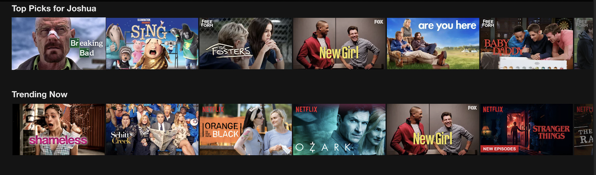

# Movie-Recommendation-Engine

## Try Recommender at https://nikhils10.github.io/ 
Visit this page and get recommendations on what to watch next !!
Enter a movie title name and get 10 another movies to watch !!

## Project Overview 
This repository helps builds a movie recommendation engine using different techniques like content based and collaborative based methods.
Content based techniques utilize the content about the movie to recommend similar movie to you. For example if you liked a movie like "Batman Begins" it would recommend you similar movies like Batman. 

In content based technique we have taken the following features of movies like its title, director, top actors , genre and combined them as one feature .
Then we use word embeddings of 300 dimensions and generate cosine similarity matrix and find similar movies for that movie.

Collaborative filtering based techniques works by searching large groups of people similar to you and recommends you what they watch.
In collaborative filtering we explored multiple methods on the utility matrix like user based, item based collaborative filtering .
In user and item based we checked taking into account tough and easy raters by normalizing the ratings .
We also checked methods matrix factorization methods like Singular Value Decomposition.

This project hosts website using github pages hosted with assets in https://github.com/nikhils10/nikhils10.github.io repository. 

## Motivation
Watching Netflix and seeing how good it is at recommending me the articles had me curious about what algorithms it uses to make those recommendations.
Very excited and feel this is a very cool area in data science and machine learning . 
Almost every service needs personalization for its users from movies on Netflix to songs on Spotify .
This can help in user retention and improving engagement .

## Problem Type
Content Recommendation

**Result Metrics**

For collaborative filtering :-
Root Mean Squared Error(RMSE),Mean Absolute Error(MAE).

## Actionable Insight
Trying different methods to recommend content to users and improve the service .
The better engine can help with better recommendations improving the platform user retention .

## Tools & Libraries Used
- **Python 3.6**
- **Surprise**
- **Spacy**
- **NLTK**
- **Pandas**        
- **Matplotlib**        
- **Sklearn**            
- **Seaborn**

       

## About the Data
This repository uses the Movielens dataset .
These files contain metadata for all 45,000 movies listed in the Full MovieLens Dataset. 
The dataset consists of movies released on or before July 2017. 
Data points include cast, crew, plot keywords, budget, revenue, posters, release dates, languages, production companies, countries, TMDB vote counts and vote averages.
This dataset also has files containing 26 million ratings from 270,000 users for all 45,000 movies. Ratings are on a scale of 1-5 and have been obtained from the official GroupLens website.

## Credits/Resources
This dataset is an ensemble of data collected from TMDB and GroupLens.

